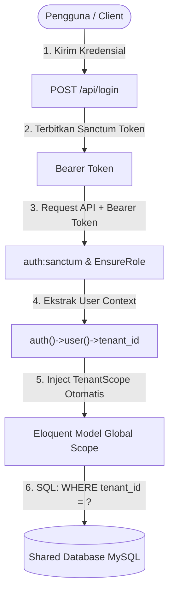
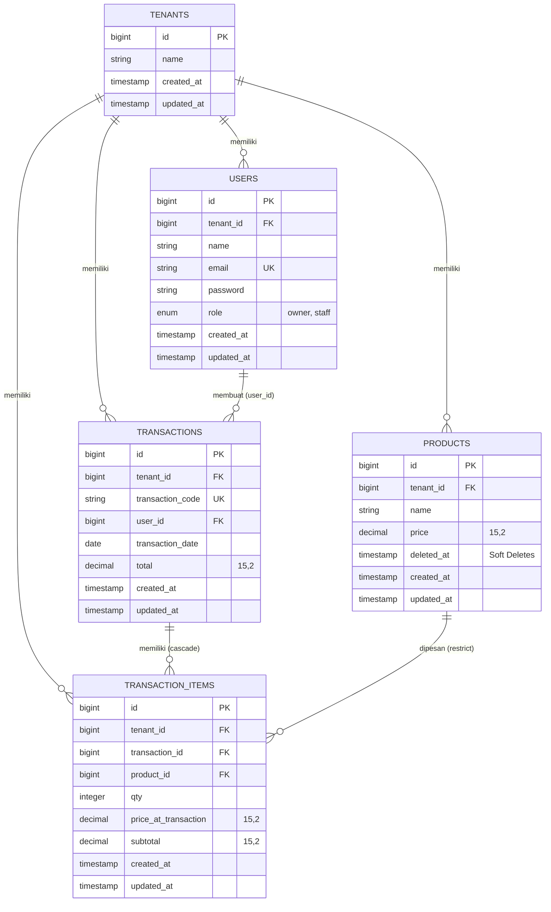

# Mini ERP SaaS Multi-Tenant Platform
### Technical Test – Fullstack Developer PT Oka Iki Indonesia

Aplikasi Mini ERP SaaS multi-tenant berbasis **Shared Database with Isolated User Context** yang dibangun menggunakan **Laravel 11 REST API** pada backend dan **Vue 3 (Composition API, Pinia, Vue Router, Tailwind CSS)** pada frontend.

Sistem dirancang dengan pola pikir ERP profesional: isolasi data antar penyewa (*tenant*) aman pada level query database dan token, penanganan transaksi atomik (*database transactions*), pembekuan harga transaksi (*price snapshotting*), perhitungan matematis presisi tanpa mempercayai data input client, pembatasan hak akses berbasis peran (*Role-Based Access Control*), dan agregasi laporan langsung dari basis data.

---

## 📑 Daftar Isi
1. [Arsitektur & Strategi Multi-Tenancy](#1-arsitektur--strategi-multi-tenancy)
2. [Desain Database & Entity Relationship](#2-desain-database--entity-relationship)
3. [Integritas Data Transaksi & Price Snapshot](#3-integritas-data-transaksi--price-snapshot)
4. [Authentication & Role-Based Authorization](#4-authentication--role-based-authorization)
5. [Daftar Akun Demo & Quick Switcher](#5-daftar-akun-demo--quick-switcher)
6. [Panduan Instalasi & Menjalankan Aplikasi](#6-panduan-instalasi--menjalankan-aplikasi)
7. [Automated Testing & Hasil Pengujian](#7-automated-testing--hasil-pengujian)
8. [Dokumentasi API Endpoints](#8-dokumentasi-api-endpoints)
9. [Postman Collection & Environment](#9-postman-collection--environment)
10. [Git Repository & Commit History](#10-git-repository--commit-history)

---

## 1. Arsitektur & Strategi Multi-Tenancy

### Pendekatan: Shared Database with Tenant Scoping
Sistem menggunakan satu database fisik bersama untuk seluruh tenant, di mana seluruh entitas data yang dimiliki tenant (`users`, `products`, `transactions`, `transaction_items`) wajib memiliki kolom referensi `tenant_id`.



### Mekanisme Pencegahan Kebocoran Data (Zero Data Leakage):
1. **User Token Context sebagai Single Source of Truth**:
   Backend tidak pernah mempercayai parameter `tenant_id` dari request body, query parameter, maupun header yang dikirim oleh client. Nilai `tenant_id` selalu diresolusi secara otomatis dari token autentikasi (`Auth::user()->tenant_id`).
2. **Eloquent Global Scope (`TenantScope`)**:
   Setiap query ke model `Product`, `Transaction`, dan `TransactionItem` secara otomatis disuntikkan klausa `WHERE table.tenant_id = auth()->user()->tenant_id`.
3. **Auto-Assignment Trait (`BelongsToTenant`)**:
   Saat menyimpan data baru (`creating` event hook), model akan otomatis mengisi `tenant_id` dari user login tanpa risiko tertinggal atau dimanipulasi melalui *mass-assignment*.
4. **Proteksi Akses ID Silang (Cross-Tenant Access Protection)**:
   Jika User dari Tenant A mencoba mengakses endpoint detail atau mengubah data Tenant B (contoh: `GET /api/products/{tenant_b_product_id}`), Eloquent Scope menyebabkan record tersebut tidak ditemukan dalam lingkup Tenant A, sehingga server langsung merespons **404 Not Found** (atau **403 Forbidden** via Policy), mencegah kebocoran informasi apakah ID tersebut ada di tenant lain.

---

## 2. Desain Database & Entity Relationship

Database menggunakan tipe data `decimal(15,2)` untuk seluruh atribut keuangan/nominal (harga produk, snapshot harga transaksi, subtotal, dan total). **Tidak pernah menggunakan tipe `float`** untuk mencegah kesalahan pembulatan representasi *floating-point IEEE 754*.



### Indeks Kunci untuk Performa:
- `products`: `(tenant_id, id)`, `(tenant_id, name)`
- `transactions`: `(tenant_id, transaction_date)`, `(tenant_id, created_at)`
- `transaction_items`: `(tenant_id, transaction_id)`, `(tenant_id, product_id)`

---

## 3. Integritas Data Transaksi & Price Snapshot

Pencatatan transaksi menerapkan standar ERP:
1. **Pemeriksaan Produk Kepemilikan Tenant**:
   Seluruh `product_id` yang diajukan divalidasi ke database. Jika terdapat salah satu ID yang bukan milik tenant aktif atau telah di-soft delete, request langsung ditolak dengan status **422 Unprocessable Entity**.
2. **Pengambilan Harga dari Database (*Price Snapshotting*)**:
   Client tidak diperbolehkan mengirimkan harga satuan atau subtotal sebagai sumber kebenaran. Sistem mengambil harga terkini langsung dari baris database produk (`Product::find($id)->price`), menyimpannya ke `price_at_transaction` pada tabel `transaction_items`.
3. **Kekebalan Riwayat terhadap Perubahan Harga Master**:
   Apabila harga pada master produk diubah di kemudian hari, harga pada transaksi masa lalu tidak akan pernah berubah karena nilai transaksi terikat pada `price_at_transaction`.
4. **Perhitungan Presisi di Backend**:
   - `subtotal = qty * price_at_transaction` dihitung menggunakan fungsi aritmetika desimal presisi (`bcmul`).
   - `total = sum(subtotal)` dihitung dengan akumulasi desimal (`bcadd`).
5. **Transaksi Database Atomik (`DB::transaction`)**:
   Pembuatan header transaksi dan seluruh baris item dibungkus dalam satu blok transaksi database ACID. Jika terjadi kegagalan di tengah proses, seluruh perubahan di-rollback secara otomatis.
6. **Immutability (Transaksi Tidak Boleh Dihapus)**:
   Sesuai prinsip akuntansi ERP, transaksi yang sudah terbit tidak dapat dihapus. Endpoint `DELETE /api/transactions/{id}` diblokir secara eksplisit dan mengembalikan HTTP **405 Method Not Allowed**.

---

## 4. Authentication & Role-Based Authorization

Sistem membedakan izin akses antara dua role: **Owner** dan **Staff**:

| Fitur / Aksi | Role Owner | Role Staff | Mekanisme Penegakan |
| :--- | :---: | :---: | :--- |
| **Login & Profil** | ✅ Diizinkan | ✅ Diizinkan | Token Sanctum (`auth:sanctum`) |
| **Lihat List Produk** | ✅ Diizinkan | ✅ Diizinkan | `ProductPolicy@viewAny` + `TenantScope` |
| **Tambah & Edit Produk** | ✅ Diizinkan | ✅ Diizinkan | `ProductPolicy@update` + `StoreProductRequest` |
| **Hapus Produk (Soft Delete)** | ✅ Diizinkan | ❌ **Ditolak (403)** | `ProductPolicy@delete` (Hanya Owner) |
| **Buat Transaksi Baru (POS)** | ✅ Diizinkan | ✅ Diizinkan | `TransactionService` + `TenantScope` |
| **Lihat Riwayat Transaksi** | ✅ Diizinkan | ✅ Diizinkan | `TransactionPolicy@viewAny` |
| **Hapus Transaksi** | ❌ **Ditolak (405)** | ❌ **Ditolak (405)** | `TransactionPolicy@delete` |
| **Laporan Omzet & Agregasi** | ✅ Diizinkan | ❌ **Ditolak (403)** | Middleware `role:owner` & `ReportFilterRequest` |

*Catatan: Pembatasan tidak hanya dilakukan dengan menyembunyikan tombol pada UI, melainkan diproteksi secara ketat pada level Controller, Middleware, dan Policy backend.*

---

## 5. Daftar Akun Demo & Quick Switcher

Database Seeder telah menyiapkan 2 Tenant dengan masing-masing 1 Owner dan 1 Staff, serta produk dan transaksi historis:

| Tenant / Perusahaan | Role | Nama Akun | Email Login | Password |
| :--- | :--- | :--- | :--- | :--- |
| **Tenant A** (PT Nusantara Niaga Mandiri) | **Owner** | Budi Pratama | `owner1@nusantara.com` | `password123` |
| **Tenant A** (PT Nusantara Niaga Mandiri) | **Staff** | Siti Rahma | `staff1@nusantara.com` | `password123` |
| **Tenant B** (CV Sentosa Solusindo) | **Owner** | Hendra Wijaya | `owner2@sentosa.com` | `password123` |
| **Tenant B** (CV Sentosa Solusindo) | **Staff** | Dewi Lestari | `staff2@sentosa.com` | `password123` |

> 💡 **Fitur Evaluator Demo**: Pada halaman login Frontend (`/login`), tersedia tombol **1-Click Quick Demo Switcher** untuk berganti akun antar-tenant secara instan tanpa mengetik ulang kredensial.

---

## 6. Panduan Instalasi & Menjalankan Aplikasi

### Kebutuhan Lingkungan:
- PHP >= 8.2 (dengan ekstensi `pdo_mysql`, `bcmath`, `mbstring`, `openssl`)
- Composer >= 2.0
- Node.js >= 18 & npm
- MySQL Server (XAMPP / Standalone)

---

### Langkah 1: Backend (Laravel API)

1. Buka terminal dan masuk ke folder `backend`:
   ```bash
   cd backend
   ```

2. Salin file environment:
   ```bash
   copy .env.example .env
   ```

3. Sesuaikan konfigurasi database pada `.env` (pastikan MySQL sudah berjalan di port 3306):
   ```env
   DB_CONNECTION=mysql
   DB_HOST=127.0.0.1
   DB_PORT=3306
   DB_DATABASE=mini_erp_saas
   DB_USERNAME=root
   DB_PASSWORD=
   ```

4. Buat database `mini_erp_saas` di MySQL (jika belum dibuat):
   ```sql
   CREATE DATABASE IF NOT EXISTS mini_erp_saas CHARACTER SET utf8mb4 COLLATE utf8mb4_unicode_ci;
   ```

5. Jalankan migrasi dan data seeder:
   ```bash
   php artisan migrate:fresh --seed
   ```

6. Jalankan development server backend:
   ```bash
   php artisan serve --port=8000
   ```
   *Backend API aktif di `http://127.0.0.1:8000`.*

---

### Langkah 2: Frontend (Vue 3 + Vite)

1. Buka terminal baru dan masuk ke folder `frontend`:
   ```bash
   cd frontend
   ```

2. Salin file `.env.example` ke `.env`:
   ```bash
   copy .env.example .env
   ```

3. Install dependensi package:
   ```bash
   npm install
   ```

4. Jalankan Vite development server:
   ```bash
   npm run dev
   ```
   *Frontend aktif di `http://localhost:5173`.*

---

## 7. Automated Testing & Hasil Pengujian

Backend dilengkapi rangkaian pengujian otomatis (*Feature Tests*) menggunakan PHPUnit yang mencakup **seluruh 10 skenario wajib** yang dipersyaratkan pada lembar Technical Test PT Oka Iki Indonesia:

```bash
cd backend
php artisan test --filter=MiniErpMultiTenantTest
```

### Ringkasan Hasil Pengujian (10/10 Passed):
```text
   PASS  Tests\Feature\MiniErpMultiTenantTest
  ✓ 1 user tenant a can only see tenant a products                                0.25s  
  ✓ 2 user tenant a cannot access or edit tenant b product via id                 0.02s  
  ✓ 3 staff cannot delete product while owner can soft delete                     0.02s  
  ✓ 4 transaction created with multiple items and accurate total                  0.03s  
  ✓ 5 transaction price snapshot taken from database not client manipulation      0.02s  
  ✓ 6 updating product price does not change past transaction snapshot            0.02s  
  ✓ 7 product from other tenant cannot be included in transaction                 0.02s  
  ✓ 8 zero or negative quantity is rejected with clear feedback                   0.02s  
  ✓ 9 report only aggregates active tenant transactions                           0.02s  
  ✓ 10 transactions cannot be deleted                                             0.02s  

  Tests:    10 passed (41 assertions)
  Duration: 0.56s
```

---

## 8. Dokumentasi API Endpoints

Semua endpoint berawalan prefix `/api`. Endpoint yang memerlukan autentikasi wajib menyertakan header:
`Authorization: Bearer <personal_access_token>`

### 1. Autentikasi
- `POST /api/login`
  - **Body**: `{"email": "owner1@nusantara.com", "password": "password123"}`
  - **Response 200**: Mengembalikan Sanctum `token` dan data `user` beserta objek `tenant`.
- `GET /api/me`
  - **Response 200**: Profil user aktif beserta relasi tenant.
- `POST /api/logout`
  - **Response 200**: Pencabutan (*revocation*) personal access token aktif.

### 2. Produk (`/api/products`)
- `GET /api/products` : Menampilkan list produk aktif tenant (mendukung parameter `?search=nama` dan `?per_page=15`).
- `POST /api/products` : Menambah produk baru (`name`, `price`).
- `GET /api/products/{id}` : Detail produk (otomatis terisolasi tenant).
- `PUT /api/products/{id}` : Memperbarui nama atau harga produk.
- `DELETE /api/products/{id}` : Soft delete produk (**Khusus Owner**, Staff mengembalikan 403).

### 3. Transaksi (`/api/transactions`)
- `GET /api/transactions` : Menampilkan riwayat transaksi tenant beserta creator dan detail item.
- `POST /api/transactions` : Membuat transaksi baru dengan price snapshotting atomik.
  - **Contoh Request Payload**:
    ```json
    {
      "transaction_date": "2026-09-08",
      "items": [
        { "product_id": 1, "qty": 2 },
        { "product_id": 3, "qty": 1 }
      ]
    }
    ```
  - **Contoh Response 201**:
    ```json
    {
      "message": "Transaksi berhasil dibuat.",
      "transaction": {
        "id": 10,
        "tenant_id": 1,
        "transaction_code": "TRX-T1-20260908-A9F412",
        "transaction_date": "2026-09-08",
        "total": "32800000.00",
        "creator": { "id": 1, "name": "Budi Pratama", "role": "owner" },
        "items": [
          {
            "id": 15,
            "product_id": 1,
            "product_name": "Paket ERP Cloud Subscription (Tahunan)",
            "qty": 2,
            "price_at_transaction": "12500000.00",
            "subtotal": "25000000.00"
          },
          {
            "id": 16,
            "product_id": 3,
            "product_name": "Implementasi & Training Sistem ERP",
            "qty": 1,
            "price_at_transaction": "7800000.00",
            "subtotal": "7800000.00"
          }
        ]
      }
    }
    ```
- `DELETE /api/transactions/{id}` : Mengembalikan HTTP **405 Method Not Allowed** (*Transaksi tidak dapat dihapus*).

### 4. Laporan Omzet (`/api/reports`)
- `GET /api/reports` : Menghitung omzet dan transaksi bulan berjalan serta rentang tanggal yang difilter.
  - **Otorisasi**: Wajib Role Owner (Staff dilarang / 403).
  - **Query Parameters (Opsional)**: `?start_date=2026-08-01&end_date=2026-09-08`
  - **Response 200**:
    ```json
    {
      "data": {
        "tenant": { "id": 1, "name": "PT Nusantara Niaga Mandiri" },
        "period": { "start_date": "2026-09-01", "end_date": "2026-09-08" },
        "current_month": {
          "total_transactions": 3,
          "total_revenue": "16600000.00"
        },
        "filtered_summary": {
          "total_transactions": 3,
          "total_revenue": "16600000.00",
          "avg_order_value": "5533333.33"
        },
        "daily_breakdown": [ ... ],
        "recent_transactions": [ ... ]
      }
    }
    ```

---

## 9. Postman Collection & Environment

Tersedia berkas ekspor Postman siap pakai di dalam folder [`postman/`](file:///c:/xampp/htdocs/oka-iki-indonesia/technical-test/postman) yang mencakup 22 endpoint requests beserta assertions dan skrip otomatis:
- **Koleksi API**: [`postman/Mini_ERP_MultiTenant_API.postman_collection.json`](file:///c:/xampp/htdocs/oka-iki-indonesia/technical-test/postman/Mini_ERP_MultiTenant_API.postman_collection.json)
- **Environment**: [`postman/Mini_ERP_Local.postman_environment.json`](file:///c:/xampp/htdocs/oka-iki-indonesia/technical-test/postman/Mini_ERP_Local.postman_environment.json)
- **Panduan Penggunaan Lengkap**: [`postman/README.md`](file:///c:/xampp/htdocs/oka-iki-indonesia/technical-test/postman/README.md)

### Fitur Utama Koleksi Postman:
1. **Auto-Token Capture**: Setiap kali menjalankan request login, token Sanctum (`Bearer {{token}}`), `user_role`, dan `tenant_name` otomatis disimpan ke environment tanpa perlu salin-tempel manual.
2. **Pengujian Multi-Tenant (Zero Data Leakage)**: Skenario akses produk lintas tenant (ekspektasi `404`) dan checkout dengan produk tenant lain (ekspektasi `422`).
3. **Pengujian RBAC**: Skenario staf mencoba menghapus produk (ekspektasi `403`) dan staf mengakses laporan keuangan (ekspektasi `403`).
4. **Pengujian ERP Immutability**: Skenario penghapusan transaksi ditolak demi integritas data (ekspektasi `405 Method Not Allowed`).

---

## 10. Git Repository & Commit History

Repository dikelola dengan commit atomik dan deskriptif:
1. `feat(backend): initialize Laravel 11 project with Sanctum and CORS configuration`
2. `feat(database): design multi-tenant schema with foreign keys, decimal precision, and soft deletes`
3. `feat(tenant): implement BelongsToTenant trait and TenantScope for shared database isolation`
4. `feat(auth): add UserRole enum, AuthController, and EnsureRole middleware`
5. `feat(products): create Product model, FormRequests, Policy, and Controller with soft deletes`
6. `feat(transactions): implement atomic TransactionService with price snapshot and decimal math`
7. `feat(reports): implement ReportService with SQL aggregation and Owner-only authorization`
8. `test: add automated feature test suite covering all 10 mandated scenarios (100% pass)`
9. `seed: create rich demo seeders with 2 tenants, 4 users, products, and transactions`
10. `feat(frontend): initialize Vue 3 Vite application with Pinia, Vue Router, and Tailwind CSS`
11. `feat(ui): build responsive SaaS layout, POS cashier, product CRUD, and reports view`
12. `docs: create comprehensive technical documentation and installation guide in README.md`
